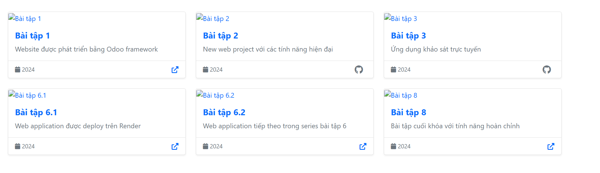

# Website Cá Nhân với Java Servlet

Website cá nhân được xây dựng bằng Java Servlet, JSP và Bootstrap với đầy đủ tính năng hiện đại.

## 🚀 Tính năng

- **Trang chủ**: Giới thiệu tổng quan, kỹ năng và dự án nổi bật
- **Giới thiệu**: Thông tin chi tiết về sinh viên, học vấn và kỹ năng
- **Dự án**: Showcase các dự án đã thực hiện
- **Liên hệ**: Form liên hệ với thông tin cá nhân
- **Responsive Design**: Tương thích mọi thiết bị
- **SEO Friendly**: Tối ưu cho công cụ tìm kiếm

## 🛠️ Công nghệ sử dụng

### Backend
- Java 11
- Java Servlet 4.0
- JSP 2.3
- JSTL 1.2
- Maven

### Frontend
- HTML5 & CSS3
- Bootstrap 5.1.3
- JavaScript ES6+
- Font Awesome 6.0
- Responsive Design

### Server
- Apache Tomcat 9+
- Maven Tomcat Plugin (để test)

## 📁 Cấu trúc dự án

```
Webcanhan/
├── src/
│   └── main/
│       ├── java/
│       │   └── com/
│       │       └── example/
│       │           ├── servlet/          # Các Servlet controller
│       │           │   ├── HomeServlet.java
│       │           │   ├── AboutServlet.java
│       │           │   ├── PortfolioServlet.java
│       │           │   ├── BlogServlet.java
│       │           │   └── ContactServlet.java
│       │           └── filter/           # Filter cho encoding
│       │               └── CharacterEncodingFilter.java
│       └── webapp/
│           ├── WEB-INF/
│           │   ├── views/               # JSP templates
│           │   │   ├── home.jsp
│           │   │   ├── about.jsp
│           │   │   ├── portfolio.jsp
│           │   │   ├── blog.jsp
│           │   │   ├── contact.jsp
│           │   │   └── error/          # Error pages
│           │   │       ├── 404.jsp
│           │   │       └── 500.jsp
│           │   └── web.xml             # Web configuration
│           ├── css/
│           │   └── style.css           # Custom styles
│           ├── js/
│           │   └── script.js           # Custom JavaScript
│           └── images/                 # Image assets
├── pom.xml                             # Maven configuration
└── README.md                           # Tài liệu này
```

## 🚦 Cài đặt và chạy

### Yêu cầu hệ thống
- Java JDK 11 hoặc cao hơn
- Maven 3.6+
- Apache Tomcat 9+ (hoặc sử dụng Tomcat Maven plugin)

### 1. Clone dự án
```bash
git clone <repository-url>
cd Webcanhan
```

### 2. Biên dịch dự án
```bash
mvn clean compile
```

### 3. Chạy với Jetty Maven Plugin
```bash
mvn jetty:run
```

Website sẽ chạy tại: `http://localhost:9090`

### 4. Đóng gói thành WAR file
```bash
mvn clean package
```

File WAR được tạo tại: `target/personal-website.war`

### 5. Deploy lên Tomcat Server (Cách khuyến nghị)
1. Copy file `personal-website.war` vào thư mục `webapps` của Tomcat 9
2. Khởi động Tomcat
3. Truy cập `http://localhost:8080/personal-website/` (lưu ý dấu `/` cuối)

## 🎨 Tùy chỉnh

### Thay đổi thông tin cá nhân

1. **Trang chủ** - Sửa file `src/main/webapp/WEB-INF/views/home.jsp`:
   - Thay đổi tên, chức danh
   - Cập nhật mô tả và kỹ năng
   - Thêm/sửa link mạng xã hội

2. **Trang giới thiệu** - Sửa file `src/main/webapp/WEB-INF/views/about.jsp`:
   - Cập nhật câu chuyện cá nhân
   - Thay đổi timeline kinh nghiệm
   - Sửa thông tin học vấn và chứng chỉ

3. **Dự án** - Sửa file `src/main/java/com/example/servlet/PortfolioServlet.java`:
   - Thêm/sửa/xóa các dự án
   - Cập nhật mô tả và công nghệ

4. **Blog** - Sửa file `src/main/java/com/example/servlet/BlogServlet.java`:
   - Thêm/sửa các bài viết mẫu
   - Cập nhật categories và tags

### Thay đổi giao diện

1. **CSS** - Sửa file `src/main/webapp/css/style.css`:
   - Thay đổi màu sắc chủ đạo
   - Tùy chỉnh fonts và spacing
   - Thêm animations

2. **JavaScript** - Sửa file `src/main/webapp/js/script.js`:
   - Thêm tính năng tương tác
   - Tùy chỉnh animations
   - Thêm validations

### Thêm tính năng mới

1. **Tạo Servlet mới**:
```java
@WebServlet("/new-feature")
public class NewFeatureServlet extends HttpServlet {
    // Implementation
}
```

2. **Tạo JSP template**:
```jsp
<%@ page contentType="text/html;charset=UTF-8" language="java" %>
<!-- JSP content -->
```

3. **Thêm link vào navigation** trong các file JSP

## 📷 Screenshots

### Trang chủ
- Hero section với thông tin cá nhân
- Showcase kỹ năng chuyên môn
- Dự án nổi bật

### Trang giới thiệu
- Câu chuyện cá nhân
- Timeline kinh nghiệm
- Kỹ năng với progress bars

### Trang dự án
- Grid layout với filter
- Modal xem chi tiết
- Responsive design

### Blog
- List bài viết với sidebar
- Search và categories
- Newsletter subscription

### Liên hệ
- Contact form với validation
- Thông tin liên hệ
- FAQ section

## 🔧 Cấu hình

### Database (Tùy chọn)
Để thêm database, bạn có thể:

1. **Thêm dependency** trong `pom.xml`:
```xml
<dependency>
    <groupId>mysql</groupId>
    <artifactId>mysql-connector-java</artifactId>
    <version>8.0.33</version>
</dependency>
```

2. **Tạo DAO classes** để xử lý database operations

3. **Cấu hình connection** trong `web.xml` hoặc properties file

### Email Service
Để gửi email từ contact form:

1. **Thêm JavaMail dependency**
2. **Cấu hình SMTP** settings
3. **Implement email service** trong ContactServlet

## 🚀 Deploy lên Production

### 1. Render (Recommended)
```bash
# 1. Push code lên GitHub
git add .
git commit -m "Add database integration"
git push origin main

# 2. Trên Render Dashboard:
# - Connect GitHub repository
# - Choose "Web Service"
# - Set build command: (Render will auto-detect Dockerfile)
# - Set start command: (Render will use Dockerfile CMD)
```

**Environment Variables cho Render:**
```
DB_HOST=your-database-host
DB_PORT=1433
DB_NAME=PersonalWebsite
DB_USERNAME=your-db-username
DB_PASSWORD=your-db-password
```

### 2. Docker Deployment
```bash
# Build and run với Docker Compose
docker-compose up -d

# Hoặc build riêng lẻ
docker build -t personal-website .
docker run -p 8080:8080 \
  -e DB_HOST=your-db-host \
  -e DB_USERNAME=sa \
  -e DB_PASSWORD=123456 \
  personal-website
```

### 3. Heroku
```bash
# Tạo Procfile
echo "web: java -jar target/dependency/webapp-runner.jar --port \$PORT target/*.war" > Procfile

# Deploy
git add .
git commit -m "Deploy to Heroku"
git push heroku main
```

### 4. AWS Elastic Beanstalk
1. Tạo WAR file: `mvn package`
2. Upload lên AWS Elastic Beanstalk
3. Cấu hình environment variables

### 5. Traditional Server
1. Build WAR file
2. Copy vào Tomcat webapps
3. Cấu hình domain và SSL

## 💾 Database Setup

### Local Development
1. Chạy script `database_setup.sql` trong SQL Server Management Studio
2. Đảm bảo SQL Server đang chạy trên port 1433
3. Sử dụng tài khoản `sa` với password `123456`

### Production
- Cấu hình database connection thông qua environment variables
- Khuyên dùng Azure SQL Database hoặc AWS RDS cho production
- Đảm bảo backup database thường xuyên

## 📞 Support

Nếu bạn gặp vấn đề hoặc có câu hỏi:

- **Email**: huypk2811@gmail.com
- **GitHub Issues**: Tạo issue trên repository
- **Documentation**: Xem SETUP_DATABASE.md cho hướng dẫn chi tiết database

## 📄 License

This project is licensed under the MIT License - see the [LICENSE](LICENSE) file for details.

## 🤝 Contributing

1. Fork the Project
2. Create your Feature Branch (`git checkout -b feature/AmazingFeature`)
3. Commit your Changes (`git commit -m 'Add some AmazingFeature'`)
4. Push to the Branch (`git push origin feature/AmazingFeature`)
5. Open a Pull Request

---

**Made with ❤️ by Vương Đức Huy**